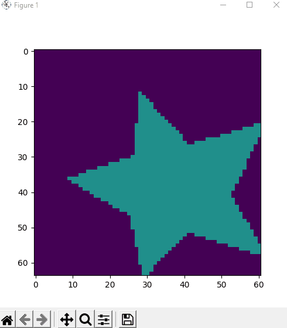

# Drums
Simulate ripples through arbitrarily drawn drum faces!

## Steps to Use
**1)** Run interface.py to use the interactive pygame window.  
**2)** Draw your simple, closed, polygon drum. 
&ensp;  **a)** Hover your mouse over the window and press 'SPACE' to place nodes. 
&ensp;  **b)** Click and drag nodes to change their locations.  
**3)** Press '/' to start the calculation (for more details on what happens, see below). 
&ensp;  **a)** You will first see the discretization of the drum. Close this window when you are done viewing it. 
&ensp;  **b)** Next, you will see the sparse matrix which represents an iteration of the wave equation on this discretized drum 
&ensp;&ensp;         along with the first nine eigenfunctions of the drum. Close these windows when you are done viewing them.  
**4)** Now that the solver is prepped, press '0' to run the simulation of your drawn surface! 

  
  <h5 align = 'center'>Example of piecewise linear gradient selection</h5>

  
  <h5 align = 'center'>Example of piecewise linear gradient selection</h5>

  
  
  
  <h5 align = 'center'>Example of piecewise linear gradient selection</h5>

  
  <h5 align = 'center'>Example of piecewise linear gradient selection</h5>

